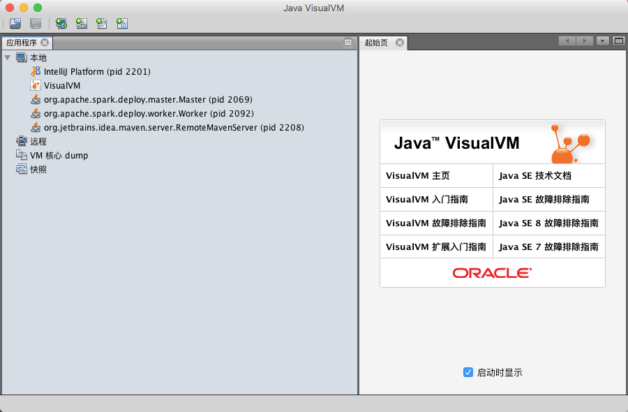
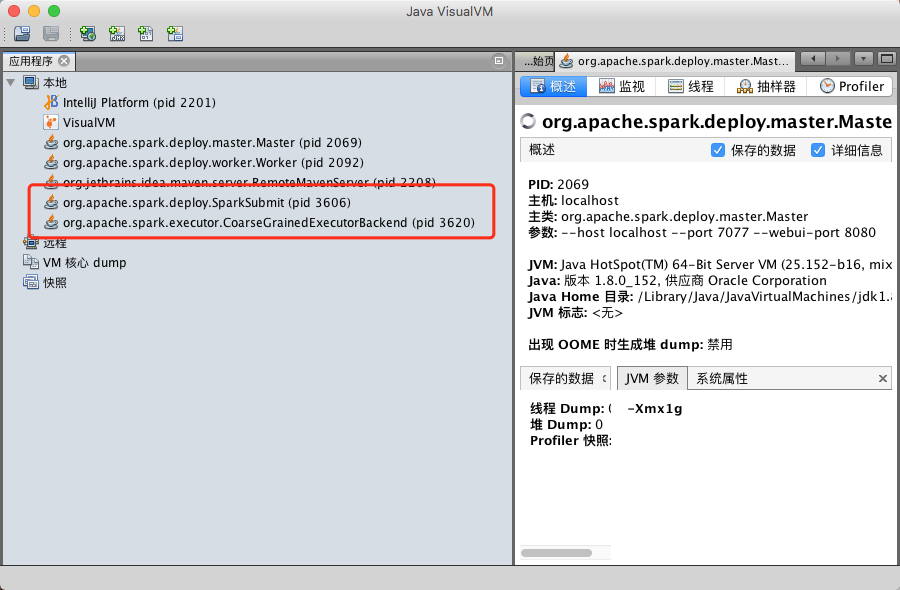
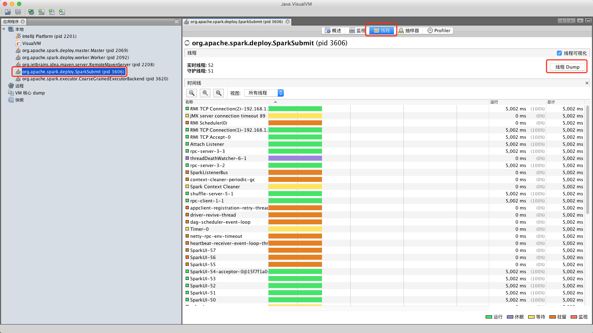
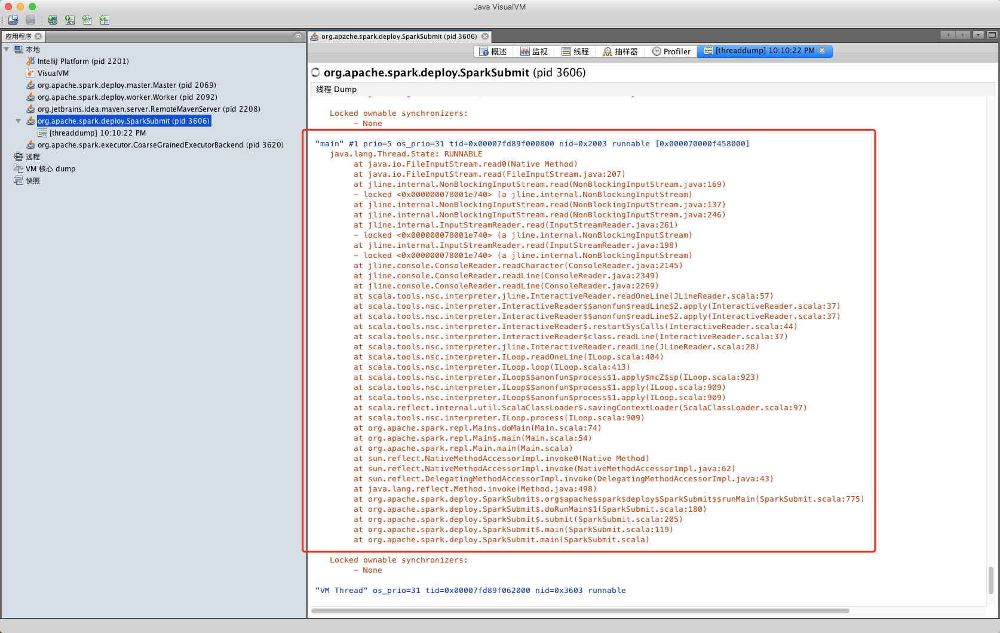

# 1. SparkContext

## 1.1 spark-shell

```bash
> echo $JAVA_HOME
/Library/Java/JavaVirtualMachines/jdk1.8.0_152.jdk/Contents/Home

> cd /Library/Java/JavaVirtualMachines/jdk1.8.0_152.jdk/Contents/Home
> ll
total 52144
-rw-rw-r--   1 root  wheel      3244  9 14 17:50 COPYRIGHT
-rw-rw-r--   1 root  wheel        40  9 14 17:50 LICENSE
-rw-rw-r--   1 root  wheel       159  9 14 17:50 README.html
-rwxrwxr-x   1 root  wheel     63933  9 14 13:48 THIRDPARTYLICENSEREADME-JAVAFX.txt
-rw-rw-r--   1 root  wheel    145180  9 14 17:50 THIRDPARTYLICENSEREADME.txt
drwxrwxr-x  46 root  wheel      1564  9 14 17:55 bin
drwxrwxr-x   9 root  wheel       306  9 14 17:50 db
drwxrwxr-x   9 root  wheel       306  9 14 17:50 include
-rwxrwxr-x   1 root  wheel   5202879  9 14 13:48 javafx-src.zip
drwxrwxr-x  10 root  wheel       340  9 14 17:52 jre
drwxrwxr-x  14 root  wheel       476  9 14 17:52 lib
drwxrwxr-x   5 root  wheel       170  9 14 17:50 man
-rw-rw-r--   1 root  wheel       427  9 14 17:50 release
-rw-rw-r--   1 root  wheel  21258665  9 14 17:50 src.zip

> bin/jvisualvm
```



> 我的电脑上已经启动了 `Spark Standalone` 模式（`org.apache.spark.deploy.master.Master && org.apache.spark.deploy.worker.Worker`）

```bash
> echo $SPARK_HOME
/Users/axu/opt/apache-spark/latest

> cd /Users/axu/opt/apache-spark/latest
> bin/spark-shell --master spark://localhost:7077
Setting default log level to "WARN".
To adjust logging level use sc.setLogLevel(newLevel). For SparkR, use setLogLevel(newLevel).
18/02/21 22:08:18 WARN NativeCodeLoader: Unable to load native-hadoop library for your platform... using builtin-java classes where applicable
Spark context Web UI available at http://192.168.1.152:4040
Spark context available as 'sc' (master = spark://localhost:7077, app id = app-20180221220819-0005).
Spark session available as 'spark'.
Welcome to
      ____              __
     / __/__  ___ _____/ /__
    _\ \/ _ \/ _ `/ __/  '_/
   /___/ .__/\_,_/_/ /_/\_\   version 2.2.1
      /_/

Using Scala version 2.11.8 (Java HotSpot(TM) 64-Bit Server VM, Java 1.8.0_152)
Type in expressions to have them evaluated.
Type :help for more information.

scala>
```







```java
"main" #1 prio=5 os_prio=31 tid=0x00007fd89f000800 nid=0x2003 runnable [0x000070000f458000]
   java.lang.Thread.State: RUNNABLE
        at java.io.FileInputStream.read0(Native Method)
        at java.io.FileInputStream.read(FileInputStream.java:207)
        at jline.internal.NonBlockingInputStream.read(NonBlockingInputStream.java:169)
        - locked <0x000000078001e740> (a jline.internal.NonBlockingInputStream)
        at jline.internal.NonBlockingInputStream.read(NonBlockingInputStream.java:137)
        at jline.internal.NonBlockingInputStream.read(NonBlockingInputStream.java:246)
        at jline.internal.InputStreamReader.read(InputStreamReader.java:261)
        - locked <0x000000078001e740> (a jline.internal.NonBlockingInputStream)
        at jline.internal.InputStreamReader.read(InputStreamReader.java:198)
        - locked <0x000000078001e740> (a jline.internal.NonBlockingInputStream)
        at jline.console.ConsoleReader.readCharacter(ConsoleReader.java:2145)
        at jline.console.ConsoleReader.readLine(ConsoleReader.java:2349)
        at jline.console.ConsoleReader.readLine(ConsoleReader.java:2269)
        at scala.tools.nsc.interpreter.jline.InteractiveReader.readOneLine(JLineReader.scala:57)
        at scala.tools.nsc.interpreter.InteractiveReader$$anonfun$readLine$2.apply(InteractiveReader.scala:37)
        at scala.tools.nsc.interpreter.InteractiveReader$$anonfun$readLine$2.apply(InteractiveReader.scala:37)
        at scala.tools.nsc.interpreter.InteractiveReader$.restartSysCalls(InteractiveReader.scala:44)
        at scala.tools.nsc.interpreter.InteractiveReader$class.readLine(InteractiveReader.scala:37)
        at scala.tools.nsc.interpreter.jline.InteractiveReader.readLine(JLineReader.scala:28)
        at scala.tools.nsc.interpreter.ILoop.readOneLine(ILoop.scala:404)
        at scala.tools.nsc.interpreter.ILoop.loop(ILoop.scala:413)
        at scala.tools.nsc.interpreter.ILoop$$anonfun$process$1.apply$mcZ$sp(ILoop.scala:923)
        at scala.tools.nsc.interpreter.ILoop$$anonfun$process$1.apply(ILoop.scala:909)
        at scala.tools.nsc.interpreter.ILoop$$anonfun$process$1.apply(ILoop.scala:909)
        at scala.reflect.internal.util.ScalaClassLoader$.savingContextLoader(ScalaClassLoader.scala:97)
        at scala.tools.nsc.interpreter.ILoop.process(ILoop.scala:909)
        at org.apache.spark.repl.Main$.doMain(Main.scala:74)
        at org.apache.spark.repl.Main$.main(Main.scala:54)
        at org.apache.spark.repl.Main.main(Main.scala)
        at sun.reflect.NativeMethodAccessorImpl.invoke0(Native Method)
        at sun.reflect.NativeMethodAccessorImpl.invoke(NativeMethodAccessorImpl.java:62)
        at sun.reflect.DelegatingMethodAccessorImpl.invoke(DelegatingMethodAccessorImpl.java:43)
        at java.lang.reflect.Method.invoke(Method.java:498)
        at org.apache.spark.deploy.SparkSubmit$.org$apache$spark$deploy$SparkSubmit$$runMain(SparkSubmit.scala:775)
        at org.apache.spark.deploy.SparkSubmit$.doRunMain$1(SparkSubmit.scala:180)
        at org.apache.spark.deploy.SparkSubmit$.submit(SparkSubmit.scala:205)
        at org.apache.spark.deploy.SparkSubmit$.main(SparkSubmit.scala:119)
        at org.apache.spark.deploy.SparkSubmit.main(SparkSubmit.scala)

```
